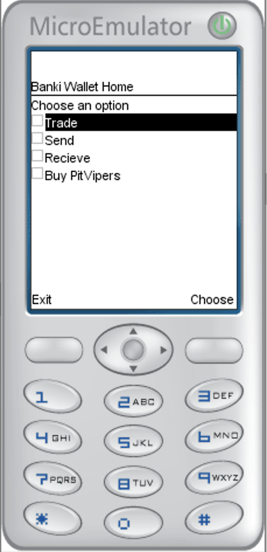

# Banki Wallet - Lightweight feature phone SPL Wallet

Solana feature phone client written for Java ME MIDP/CLDC. This client handles interactions between feature phone users and the [Solana RPC API.](https://docs.solana.com/developing/clients/jsonrpc-api) 

  
&nbsp; &nbsp; &nbsp; &nbsp;
  

## Background

### Problem

African banks are taking advantage of the market

- Strict regulations and high costs have lead to an uncompetitive banking sector throughout Africa

- South African bank fees are four times higher than that of Germany, Australia, and even India

- Over the next five years smartphone connections in sub-Saharan Africa will almost double to reach 678 million by the end of 2025, an adoption rate of 65%

- Roughly 66% of the 1.2 billion don’t have a bank account

### Solution

Looks like a bank account, works like a crypto wallet

- Decentralized stablecoin centered mobile wallet

- Safe and intuitive interface for users/businesses

- Running on Solana
    - Censorship resistant - It can’t be shut-down, funds can’t be seized

- Instant transactions that cost less than 1 cent
Highly secure

## Features

## Traction

To solve this problem we’ve decided to focus on the South African market first and eventually expand into the rest of Africa.

Our first goal was to find a local stablecoin so we formed a partnership with fiat backed [zarp.cash(https://www.zarp.cash/), there are also algorithmic stablecoin providers such as [terra.money](https://www.terra.money/)

## Dependencies

Initially, we worked on a dependency free version of the Banki feature wallet. Since we were developing on CLDC 1.1, [all signs](https://stackoverflow.com/a/10152212) pointed to us to calculating dependecy trees (we actually started doing this) and include sources into our project. Luckily, we have found a workaround on CLDC 1.8 which means we can include dependecies. 

So far, we have 1 dendency: [Solanaj](https://github.com/skynetcapital/solanaj)

## Installation + Emulation

To intall this on an emulator is pretty challenging. Most of Oracle's JME SDK's provide emulators but none of them seem to work. The only emulator we got working was [MicroEmulator.](https://microemulator.soft112.com/)

To install and test our project, the easiest option would be to download the source code and compile either via command line or via Netbeans or Eclipse.

IDE's make building a JME project far easier, but they also have issues so learning how to use the SDK is probably the best way to go.

## Contribution

Please feel free to reach out on [twitter](https://twitter.com/bankiAfrica) or submit a pull request.

## License
Banki's feature wallet is available under the MIT license. See the LICENSE file for more info.

## Credits
We thank @skynetcap for his great work on Solanaj. And we thank Solana for hosting a fun hackathon.